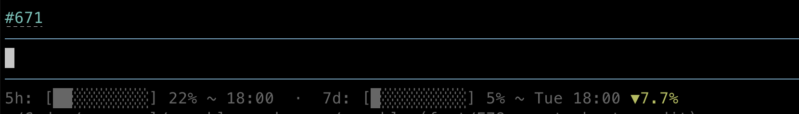

# pi extensions

This repository contains a small set of extensions for [pi-coding-agent](https://github.com/badlogic/pi-mono/tree/main/packages/coding-agent) that display additional information in the UI.

## Screenshot

## Included extensions

### `branch-pr-widget.ts`

Shows the GitHub PR number linked to the current branch in the active repository.

- Fetches PR information via `gh pr view --json number,url`
- Renders the PR number as a clickable link
- Refreshes on:
  - `session_start`
  - `session_switch`
  - `agent_end`

### `usage-widget.ts`

Displays Anthropic account usage information.

- Shows usage bars for `5h` and `7d`
- Displays reset times
- Computes the 7-day pace difference
- Only appears when the selected model belongs to an Claude provider

## Usage

1. Make sure [pi-coding-agent](https://github.com/nicholasgasior/pi-coding-agent) is installed and configured
2. Place the extension files from this repository into your pi extensions directory: `~/.pi/agent/extensions`
3. Restart or reload pi

## Notes

- `branch-pr-widget.ts` expects the current repository to already be associated with a GitHub PR
- `usage-widget.ts` requires an Anthropic OAuth API key
- If no relevant data is available, the widget will stay hidden or not render

## License

MIT License
