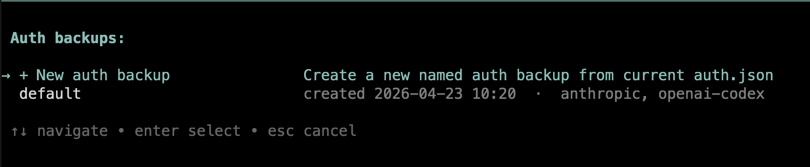
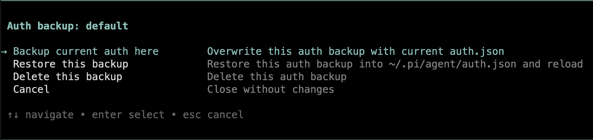

# pi extensions

A small collection of extensions for [pi-coding-agent](https://github.com/badlogic/pi-mono/tree/main/packages/coding-agent).

## Included extensions

| File | What it does | How to use | Requirements |
|---|---|---|---|
| `auth-backup.ts` | Manages backups of `~/.pi/agent/auth.json` through a single interactive command | Run `/auth-backup` | Interactive UI |
| `branch-pr-widget.ts` | Shows the GitHub PR for the current branch | Auto-runs on session start and after agent turns | `gh` installed, current repo branch associated with a PR |
| `docs-changes.ts` | Shows changed files under `docs/` as a widget | Auto-runs on session start and after agent turns | Git repo with a `docs/` directory |
| `replace-pi-with-claude-code.ts` | Rewrites `pi` to `claude code` in the system prompt | Auto-runs before each agent start | None |
| `usage-widget.ts` | Shows Anthropic or Codex usage bars for the active provider | Auto-runs on session start, model change, and after agent turns | Valid Anthropic OAuth or OpenAI Codex auth |

## Installation

Copy any extension file into your pi extensions directory:

```bash
cp auth-backup.ts ~/.pi/agent/extensions/
cp branch-pr-widget.ts ~/.pi/agent/extensions/
cp docs-changes.ts ~/.pi/agent/extensions/
cp replace-pi-with-claude-code.ts ~/.pi/agent/extensions/
cp usage-widget.ts ~/.pi/agent/extensions/
```

Then reload pi:

```text
/reload
```

You can also load a file directly for testing:

```bash
pi -e ./auth-backup.ts
```

## Extensions

### `auth-backup.ts`

Interactive auth backup manager for `~/.pi/agent/auth.json`.

Behavior:

- Stores backups under `~/.pi/agent/auth-backups/`
- Uses one command: `/auth-backup`
- Shows an interactive list with:
  - `+ New auth backup`
  - existing backups with creation time and provider summary
- For an existing backup, opens an action menu:
  - `Backup current auth here`
  - `Restore this backup`
  - `Delete this backup`

Restore overwrites the full `~/.pi/agent/auth.json` and reloads pi.

Use it when:

- you switch between multiple auth setups
- you want to save the current login state before replacing it
- you want to restore a previous full auth state quickly

#### Screenshots

Backup list:



Action menu:



### `branch-pr-widget.ts`

Shows the GitHub PR number and URL for the current branch.

Behavior:

- Runs `gh pr view --json number,url`
- Displays a widget when a PR is found
- Refreshes on:
  - `session_start`
  - `session_switch`
  - `agent_end`

Use it when:

- you work in a GitHub repo with branch-to-PR mapping
- you want the active PR visible in the UI

### `docs-changes.ts`

Shows changed files in `docs/` as a widget.

Behavior:

- Reads tracked changes from `git diff --name-status HEAD -- docs/`
- Reads untracked files from `git ls-files --others --exclude-standard -- docs/`
- Ignores `docs/index.md` and nested `index.md`
- Refreshes on:
  - `session_start`
  - `session_switch`
  - `agent_end`

Use it when:

- you are editing documentation alongside code
- you want a compact docs change summary visible at all times

### `replace-pi-with-claude-code.ts`

Rewrites occurrences of `pi` in the system prompt to `claude code` before each run.

Behavior:

- Hooks `before_agent_start`
- Replaces ` pi` case-insensitively with ` claude code`
- Only changes the system prompt when a replacement is needed

Use it when:

- you want the agent framed as Claude Code instead of pi

### `usage-widget.ts`

Shows usage information for the active provider when supported.

Supported providers:

- `anthropic`
- `openai-codex`

Behavior:

- Displays usage bars for primary and secondary windows
- Shows reset times
- Computes a 7-day pace delta for Anthropic-style usage windows
- Caches usage briefly to avoid excessive requests
- Refreshes on:
  - `session_start`
  - `model_select`
  - `agent_end`

Data sources:

- Anthropic: `https://api.anthropic.com/api/oauth/usage`
- Codex: `https://chatgpt.com/backend-api/wham/usage`

Use it when:

- you want quota visibility while working
- you switch between Anthropic and Codex models

#### Screenshot


## Notes

| Extension | Notes |
|---|---|
| `auth-backup.ts` | Requires interactive UI. Restore replaces the full auth file, not a single provider entry. |
| `branch-pr-widget.ts` | Hidden when no PR is associated with the current branch or `gh` is unavailable. |
| `docs-changes.ts` | Hidden when there is no `docs/` directory or no matching changes. |
| `replace-pi-with-claude-code.ts` | Only affects prompt text, not UI labels or command names. |
| `usage-widget.ts` | Hidden when the active provider is unsupported or no usage data is available. |

## License

MIT License
