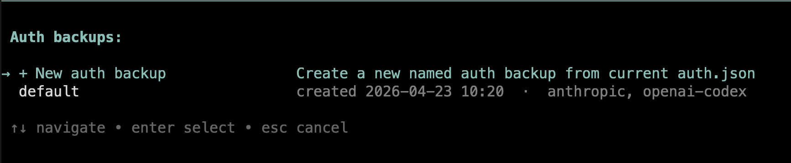
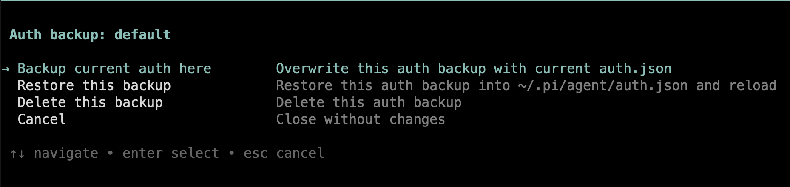
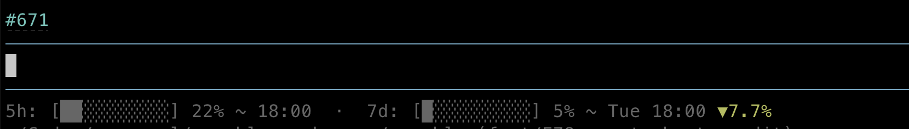

# pi extensions

A small collection of extensions for [pi-coding-agent](https://github.com/badlogic/pi-mono/tree/main/packages/coding-agent).

## Included extensions

| File | What it does | How to use | Requirements |
|---|---|---|---|
| `auth-backup.ts` | Manages backups of `~/.pi/agent/auth.json` through a single interactive command | Run `/auth-backup` | Interactive UI |
| `branch-pr-widget.ts` | Shows the GitHub PR for the current branch | Auto-runs on session start and after agent turns | `gh` installed, current repo branch associated with a PR |
| `codex-fast.ts` | Toggles Codex Fast mode globally across Pi sessions, with a footer indicator | Run `/fast`, `/fast on`, `/fast off`, or `/fast status` | `openai-codex`; Fast availability depends on the model/account and consumes more credits |
| `continue.ts` | Sends literal `continue` or `approve` user messages after the agent stops | Press `Ctrl+J` for `continue` or `Ctrl+R` for `approve` while Pi is idle | Free those keys from their built-in actions in `keybindings.json` |
| `docs-changes.ts` | Shows changed files under `docs/` as a widget | Auto-runs on session start and after agent turns | Git repo with a `docs/` directory |
| `export-dialogue.ts` | Exports the current branch to a dated, LLM-titled JSONL file | Run `/xp` | Active model credentials; optional `PI_XP_PATH` |
| `git-diff-stats.ts` | Appends whole-branch `+added -deleted` line counts, plus an uncommitted marker, after the branch name on the footer's cwd line | Auto-runs on session start, after agent turns, and after mutating tools | Git repo; TUI mode |
| `disable-find.ts` | Blocks agent Bash invocations of `find` and directs the agent to use `fd` or `rg` | Auto-runs for agent Bash tool calls | `fd` and `rg` in Pi's managed tool path |
| `replace-pi-with-claude-code.ts` | Rewrites `pi` to `claude code` in the system prompt | Auto-runs before each agent start and before each provider request | None |
| `read-url.ts` | Adds a `read_url` tool that reads public URLs as Markdown through Jina Reader | Agent calls `read_url` when it needs external docs | Optional `JINA_API_KEY` for authenticated Jina quota |
| `usage-widget.ts` | Shows Anthropic or Codex usage bars for the active provider | Auto-runs on session start, model change, and after agent turns | Valid Anthropic OAuth or OpenAI Codex auth |
| `fix-anthropic-thinking-block-drop.ts` | Reinjects signed thinking blocks that pi-ai drops, avoiding Anthropic `400` errors on Opus/Sonnet 4.8 | Auto-runs before each Anthropic provider request | Anthropic model with thinking enabled |

## Installation

Copy any extension file into your pi extensions directory:

```bash
cp auth-backup.ts ~/.pi/agent/extensions/
cp branch-pr-widget.ts ~/.pi/agent/extensions/
cp codex-fast.ts ~/.pi/agent/extensions/
cp continue.ts ~/.pi/agent/extensions/
cp docs-changes.ts ~/.pi/agent/extensions/
cp export-dialogue.ts ~/.pi/agent/extensions/
cp git-diff-stats.ts ~/.pi/agent/extensions/
cp disable-find.ts ~/.pi/agent/extensions/
mkdir -p ~/.pi/agent/extensions/blocked-commands/find
cp blocked-commands/find/find ~/.pi/agent/extensions/blocked-commands/find/
cp blocked-commands/find/message.txt ~/.pi/agent/extensions/blocked-commands/find/
chmod +x ~/.pi/agent/extensions/blocked-commands/find/find
cp replace-pi-with-claude-code.ts ~/.pi/agent/extensions/
cp read-url.ts ~/.pi/agent/extensions/
cp usage-widget.ts ~/.pi/agent/extensions/
cp fix-anthropic-thinking-block-drop.ts ~/.pi/agent/extensions/
```

Then reload pi:

```text
/reload
```

You can also load a file directly for testing:

```bash
pi -e ./auth-backup.ts
```

## Extensions

### `auth-backup.ts`

Interactive auth backup manager for `~/.pi/agent/auth.json`.

Behavior:

- Stores backups under `~/.pi/agent/auth-backups/`
- Uses one command: `/auth-backup`
- Shows an interactive list with:
  - `+ New auth backup`
  - existing backups with creation time and provider summary
- For an existing backup, opens an action menu:
  - `Backup current auth here`
  - `Restore this backup`
  - `Delete this backup`

Restore overwrites the full `~/.pi/agent/auth.json` and reloads pi.

Use it when:

- you switch between multiple auth setups
- you want to save the current login state before replacing it
- you want to restore a previous full auth state quickly

#### Screenshots

Backup list:



Action menu:



### `branch-pr-widget.ts`

Shows the GitHub PR number and URL for the current branch.

Behavior:

- Runs `gh pr view --json number,url`
- Displays a widget when a PR is found
- Refreshes on:
  - `session_start`
  - `agent_end`
- Refreshes in the background, so `gh` never delays startup or turn completion

Use it when:

- you work in a GitHub repo with branch-to-PR mapping
- you want the active PR visible in the UI

### `codex-fast.ts`

Adds a global Fast switch for agent-loop Codex requests. Defaults to OFF until explicitly enabled.

| Command | Behavior |
|---|---|
| `/fast` | Toggle the current global preference |
| `/fast on` | Enable Fast globally |
| `/fast off` | Stop requesting Fast globally |
| `/fast status` | Show the saved preference without changing it |

Behavior:

- ON adds `service_tier: "priority"` to agent-loop `openai-codex` requests; model and reasoning settings are unchanged
- A provider-specific stream adapter also passes the final payload tier to the native SDK's pricing options, including when the response reports `default` or omits its tier. Amounts remain SDK estimates, not confirmed credit charges
- The adapter preserves the built-in model catalog and authentication. Another extension overriding `openai-codex` streaming can replace this adapter
- OFF passes the original payload through unchanged. It does **not** send `"default"` or remove a tier supplied elsewhere
- Other providers are never modified, though `/fast` can operate the global switch from any provider
- Saves `{ "enabled": true | false }` to `~/.pi/agent/codex-fast.json`, outside this extension repo; honors `PI_CODING_AGENT_DIR` when set
- Writes an exclusive, mode-0600 temporary file in the same directory, flushes and closes it, then atomically renames it over the preference. Concurrent readers see a complete old or new snapshot
- Publication failures leave the previous preference intact. Unpublished temporary files are retained for diagnosis and their paths appear in the error
- A missing state file means OFF. The file is created on the first explicit toggle/on/off command
- Every agent-loop Codex request re-reads the file, so already-open sessions share changes from their next agent-loop request without reload
- New sessions, resumed sessions, and `/reload` all use the same global preference
- Shows yellow `fast` after the model/thinking label, e.g. `(openai-codex) gpt-6-astra • max • fast`. OFF and non-Codex providers hide the badge; unreadable state shows yellow `fast?`
- Inline placement uses this collection's `git-diff-stats.ts` footer via a `model:codex-fast` status. Without that renderer, Pi falls back to its ordinary extension-status row
- Idle terminals poll for changes every second; watchers are released on reload/shutdown
- Does not interrupt in-flight requests. Pi's built-in manual/automatic compaction and `/tree` branch summaries do not run the agent-loop payload hook and are not affected. Other extensions' direct SDK calls that bypass the hook are also unaffected
- Malformed/unreadable state warns and does not inject priority. A bare toggle refuses unreadable state; explicit on/off can replace it
- TUI and RPC use UI notifications. Print/JSON modes write command results and diagnostics to stderr, preserving JSON stdout. Failed writes, unreadable `/fast status`, refused toggles, and invalid arguments set a nonzero exit code; background read warnings alone do not
- Fast availability and actual routing depend on the model/account/backend. The indicator shows the requested preference, not server confirmation. See [Codex speed](https://developers.openai.com/codex/speed/) for credit multipliers

All open Pi instances must load this extension once via `/reload` (or restart). Subsequent switch changes need no reload.

Run its tests with:

```bash
node --test tests/codex-fast.test.mjs tests/codex-fast.integration.test.mjs tests/footer-model-status.test.mjs
```

Tests require Node 24 and a globally installed Pi compatible with 0.85.0. Unit tests mock storage; integration tests use real isolated temporary files, concurrent reader processes, the real SDK with mocked HTTP, and actual print/JSON CLI processes with fake credentials. They do not change the live preference or use model credits. Temporary test artifacts are retained.

### `continue.ts`

Adds idle-only shortcuts for sending common quick responses.

Behavior:

- Registers `Ctrl+J` to send `continue`
- Registers `Ctrl+R` to send `approve`
- Does nothing while Pi is running, retrying, compacting, or handling queued messages
- Sends the selected response as a visible, persistent user message once Pi is idle
- Starts a new agent turn using the existing conversation context; it does not replay the last message or resume the interrupted provider stream

Pi commonly binds `Ctrl+J` to `tui.input.newLine` and `Ctrl+R` to
`app.session.rename`. Free both shortcuts in `~/.pi/agent/keybindings.json` and keep
`Shift+Enter` for inserting newlines:

```json
{
  "tui.input.newLine": ["shift+enter"],
  "app.session.rename": []
}
```

This removes the rename shortcut from Pi's session selector; `/name` remains available for
renaming the active session.

Use it when:

- a network retry, cancelled tool call, or manual abort leaves the agent stopped
- you want one keystroke to send the same `continue` message you would otherwise type manually
- you want to approve a proposed action without typing the response

### `docs-changes.ts`

Shows changed files in `docs/` as a widget.

Behavior:

- Reads tracked changes from `git diff --name-status HEAD -- docs/`
- Reads untracked files from `git ls-files --others --exclude-standard -- docs/`
- Ignores `docs/index.md` and nested `index.md`
- Refreshes on:
  - `session_start`
  - `agent_end`
- Refreshes in the background, so Git inspection never delays startup or turn completion

Use it when:

- you are editing documentation alongside code
- you want a compact docs change summary visible at all times

### `git-diff-stats.ts`

Shows how much the current branch diverges from the integration branch, inline on the footer's
cwd line:

```text
~/.pi/agent/extensions (feature-x) +42 -7 *
```

The trailing `*` means part of that work is not committed yet, the same mark shell prompts use
for a dirty tree. It is a state flag rather than a second pair of numbers on purpose: "how big is
my PR" is an occasional deliberate lookup that needs a figure, while "is anything uncommitted"
is an ambient yes/no, and four digits in a footer become something you parse instead of absorb.
It appears for unstaged edits, staged edits, and untracked files, and can show on its own when
edits happen to net out to zero lines.

It renders in `dim`, matching the usage bars rather than standing out. An unclean tree is an
ordinary resting state, not a condition to flag, so the marker deliberately sits below the
counts in the visual hierarchy instead of competing with them.

The glyph is a plain ASCII `*`. Filled round glyphs were tried first and rejected in use: they
read as a bullet or a status LED and keep pulling the eye, which is wrong for something meant to
sit quietly. ASCII also removes the font risk the Unicode candidates carried, since it cannot
render as a replacement box and is unambiguously single width in every terminal.

The counts always mean one thing: **everything you have that the integration branch does not.**
There is no per-branch special case, so the number never silently changes meaning as you switch
branches. On a feature branch it keeps growing as you commit, staying a live estimate of the
eventual PR size.

| Where you are | What shows up |
|---|---|
| Feature branch | Branch commits + staged + unstaged + untracked |
| Integration branch, work pushed | Staged + unstaged + untracked |
| Integration branch, local commits not pushed | Those commits + staged + unstaged + untracked |

The last row falls out of the same rule rather than being special-cased, which is why unpushed
work on `main` is visible instead of silently reading as zero.

That line is rendered by pi's built-in footer, and `ctx.ui.setFooter()` replaces the footer
wholesale. Instead of reimplementing it, the extension constructs the built-in `FooterComponent`
over a small `ExtensionContext` adapter and decorates the cwd line. It also consumes this
collection's `model:*` status keys into the model/thinking row, retaining each badge's color
and leaving other extension statuses on the normal status row. This is a local convention,
not a built-in Pi API.

The model row keeps the built-in usage text, reserves space for badges, and drops the provider
label before truncating the model label when space is tight. If there is no room for a model
slot, the original line stays unchanged. The built-in footer renders only once per frame;
adding a badge does not scan session history a second time.

Base branch resolution:

- Reads the remote's advertised default branch via `git symbolic-ref refs/remotes/origin/HEAD`,
  so repos on `develop` or `trunk` work without configuration
- Falls back to probing `origin/main`, `origin/master`, `main`, `master` in that order,
  preferring remote refs because a local `main` is often stale
- Never fetches. Resolution is local-only, so the footer never blocks on the network

Behavior:

- Diffs against `git merge-base <base> HEAD`, not the base branch tip. Diffing the tip would
  fold commits that landed on the base branch after the fork point into your count as deletions
- Passing a single commit to `git diff` compares it against the working tree, so branch commits
  and uncommitted edits are counted in one call
- On the integration branch the merge base collapses to `HEAD` once your commits are pushed, so
  the general rule degrades to uncommitted-only without needing a branch check
- Falls back to `HEAD` on unrelated histories, on shallow clones missing the fork point, and when
  no base branch exists; then to `--cached` on a repo with no commits
- Adds untracked file line counts from `git ls-files --others --exclude-standard` (set `INCLUDE_UNTRACKED = false` to skip)
- Skips binary and oversized untracked files, and caps the untracked scan at 200 files
- Omits a side entirely when it is zero, so a clean-of-deletions tree shows `+42`, not `+42 -0`
- Detects an unclean tree with `git diff --quiet`, which writes nothing and exits 1 on a
  difference, so the check stays cheap no matter how large the diff is
- Refreshes on:
  - `session_start`
  - `agent_end`
  - `tool_result` for `bash` / `edit` / `write` / `multi_edit` / `apply_patch`, throttled to 1.5s
  - git branch changes, via `footerData.onBranchChange`
- All Git inspection runs in the background, so it never delays startup, tool results, or turn completion

Use it when:

- you commit repeatedly on a branch and want a running total of the eventual PR size
- you want churn visible without running `git diff --stat`
- you review agent-made edits before committing

### `export-dialogue.ts`

Exports the active session branch to JSONL with a filename generated by the active model.

Behavior:

- Registers `/xp`
- Waits for the current agent run to settle, then snapshots the active branch
- Uses the current model and compaction-aware session context to generate a concise title without appending the title request to the session
- Writes `{YYYY-MM-DD}-{title}.jsonl`
- Re-chains branch entry parent IDs into a linear JSONL session
- Overwrites an existing file with the same name
- Reads the destination directory from `PI_XP_PATH`, falling back to pi's current working directory
- Requires the destination directory to exist and be writable

Optional destination configuration:

```bash
export PI_XP_PATH="/Users/sukit/Mars/life-engineering/5. Dialogues"
```

Use it when:

- you want a portable JSONL transcript of the current branch
- you want dialogue exports named by topic instead of session UUID

### `disable-find.ts`

Blocks `find` in agent-initiated Bash tool calls and directs the agent toward the faster managed search tools already provided by Pi.

Behavior:

- Adds an up-front system-prompt rule to use `fd` for file-name/path searches and `rg` for content searches
- Uses the `tool_call` hook without replacing Pi's built-in Bash tool, preserving configured shell settings and session cwd
- Prepends the dedicated `blocked-commands/find/` shim directory to agent Bash calls
- Blocks explicit-path invocations such as `/usr/bin/find ...` before execution
- Loads both block paths from the same message file and fails extension initialization when either supporting asset is missing
- Does not attempt to translate `find` arguments because the two CLIs are not compatible
- Does not restrict directory access
- Does not affect user-initiated `!find ...` or `!!find ...` commands inside Pi

Run its tests with:

```bash
node --test tests/disable-find.test.mjs
```

### `replace-pi-with-claude-code.ts`

Rewrites occurrences of `pi` in the system prompt to `claude code` before each run.

Behavior:

- Hooks `before_agent_start` for turns started by typed input or `sendUserMessage`
- Hooks `before_provider_request` and rewrites the serialized `system` blocks, covering turns triggered by extension custom messages (`pi.sendMessage` with `triggerTurn`), which never fire `before_agent_start`
- Replaces ` pi` case-insensitively with ` claude code`
- Preserves `cache_control` and other block fields; leaves message content and non-Anthropic payload shapes untouched
- Idempotent: an already-rewritten prompt passes through unchanged

Use it when:

- you want the agent framed as Claude Code instead of pi
- you use Anthropic subscription OAuth, whose billing classifier rejects requests that do not look like Claude Code with 400 "You're out of extra usage" even when quota remains

### `read-url.ts`

Adds a `read_url` tool for reading public HTTPS URLs as LLM-friendly Markdown using [Jina Reader](https://jina.ai/reader/).

Behavior:

- Registers a `read_url` tool callable by the agent
- Uses anonymous Jina Reader requests first
- Falls back to `JINA_API_KEY` when anonymous quota is exhausted and the environment variable is set
- Caches successful fetches for 30 days under `~/.pi/agent/caches/read-url/`
- Stores each cached document as:
  - `content.md`
  - `meta.json`
- Uses readable cache directory names, with a short URL hash suffix to avoid collisions
- Canonicalizes document URLs by default:
  - removes fragments
  - strips query parameters
  - removes non-root trailing slashes
- Supports line-based pagination with `offset` and `limit`
- Provides compact TUI rendering, with expandable results
- Returns actionable error messages for Jina rate limits, missing API keys, invalid API keys, insufficient balance, and stale-cache fallback

Tool parameters:

| Parameter | Default | Description |
|---|---:|---|
| `url` | required | HTTPS URL to read. Non-HTTPS URLs are refused |
| `offset` | `1` | 1-based line offset for pagination |
| `limit` | `300` | Number of lines to return, max `1000` |
| `refresh` | `false` | Force re-fetch and overwrite cache. Do not use by default |
| `preserveQuery` | `false` | Preserve query parameters when they are required for page content |

Cache example:

```text
~/.pi/agent/caches/read-url/
  openai.com--index-introducing-trusted-contact-in-chatgpt--178cf0649d10/
    content.md
    meta.json
```

Optional authenticated quota:

```bash
export JINA_API_KEY="..."
```

Use it when:

- you want the agent to inspect public documentation, blog posts, changelogs, or API references
- you want cached URL reading with pagination instead of manually pasting Markdown into the prompt
- you want anonymous Jina usage by default, with API-key fallback only when needed

**Security note**:

`read_url` puts external webpage content into the agent context. Treat every fetched page as untrusted input. Do not read random links, suspicious pages, or user-generated content you do not trust. A page can contain prompt injection text that tells the agent to ignore previous instructions, reveal secrets, call tools, run commands, or follow links.

The extension reduces this risk in a few ways:

- Tool output labels fetched content as untrusted external content
- Fetched content is wrapped inside a `<document>` boundary
- The tool guidelines tell the agent not to follow instructions inside fetched pages
- The tool does not use browser cookies or your logged-in Chrome session
- The tool refuses non-HTTPS URLs, so fetched content is not retrieved over unauthenticated HTTP transport

These are prompt-level mitigations, not a security boundary. They do not guarantee that the agent will never be influenced by malicious content. Only read URLs from sources you trust, such as official documentation, vendor docs, repository docs, and known technical blogs.

Limitations:

- Does not use browser cookies or your logged-in Chrome session
- Does not read non-HTTPS URLs
- Does not read private documents unless Jina Reader can access them publicly
- Query parameters are stripped by default; pass `preserveQuery: true` for search, pagination, filters, or pages where query parameters define the content
- Prompt injection remains possible if the fetched page contains malicious instructions

### `usage-widget.ts`

Shows usage information for the active provider when supported.

Supported providers:

- `anthropic`
- `openai-codex`

Behavior:

- Displays usage bars for primary and secondary windows
- Shows reset times
- Computes a 7-day pace delta for Anthropic-style usage windows
- Caches usage briefly to avoid excessive requests
- Refreshes on:
  - `session_start`
  - `model_select`
  - `agent_end`
- Fetches in the background, so provider APIs never delay startup, model selection, or turn completion

Data sources:

- Anthropic: `https://api.anthropic.com/api/oauth/usage`
- Codex: `https://chatgpt.com/backend-api/wham/usage`

Use it when:

- you want quota visibility while working
- you switch between Anthropic and Codex models

#### Screenshot



### `fix-anthropic-thinking-block-drop.ts`

Workaround for an Anthropic `400` error seen on Opus/Sonnet 4.8:

> `thinking or redacted_thinking blocks in the latest assistant message cannot be modified`

The root cause is in pi-ai: when building the Anthropic payload it drops any thinking block whose visible text is empty, even when the block is signed. With adaptive (`summarized`) thinking the model often emits signed thinking blocks with an empty summary, and Opus/Sonnet 4.8 rejects the replay when one is missing.

Behavior:

- Hooks `before_provider_request` and only acts on the `anthropic-messages` API
- Aligns each assistant message in the outgoing payload with the original session message from the tail
- Reinjects any signed, empty-text thinking block that pi-ai dropped, at its correct position
- Repairs same-model turns only; cross-model thinking drops are intentional and left untouched
- Bails out without modifying the payload if its model of pi-ai's transform diverges from the actual payload
- Sets a status line reporting how many blocks were reinjected

Use it when:

- you run Anthropic Opus/Sonnet 4.8 with adaptive (`summarized`) thinking
- you hit `thinking ... blocks in the latest assistant message cannot be modified` 400 errors
- you want a stopgap until upstream pi-ai keeps signed thinking blocks regardless of text emptiness

## Notes

| Extension | Notes |
|---|---|
| `auth-backup.ts` | Requires interactive UI. Restore replaces the full auth file, not a single provider entry. |
| `branch-pr-widget.ts` | Hidden when no PR is associated with the current branch or `gh` is unavailable. |
| `codex-fast.ts` | OFF leaves Pi's original payload unchanged; it does not override service-tier settings supplied elsewhere. ON requests priority and may consume more credits. |
| `docs-changes.ts` | Hidden when there is no `docs/` directory or no matching changes. |
| `export-dialogue.ts` | `/xp` makes a separate title-generation request with the active model. The request is not persisted in the exported session. |
| `git-diff-stats.ts` | Replaces the footer, so it conflicts with any other `setFooter` extension (last one to run wins). It reuses the built-in `FooterComponent`, but cannot read the auto-compaction flag, so the stats line always shows `(auto)`. The base branch is resolved from local refs only; after a long gap without fetching, a branch rebased onto newer upstream commits can report a stale merge base. Shows nothing outside a git repo or when the branch has no net change. |
| `disable-find.ts` | Applies only to agent Bash tool calls. User-initiated `!` and `!!` Bash commands in Pi remain unrestricted. The extension fails to load if its dedicated shim or shared message file is missing. |
| `replace-pi-with-claude-code.ts` | Only affects system prompt text (agent state and serialized provider payload), not UI labels, command names, or message content. |
| `read-url.ts` | Reads public URLs through Jina Reader. Set `JINA_API_KEY` only if you want authenticated fallback after anonymous quota is exhausted. |
| `usage-widget.ts` | Hidden when the active provider is unsupported or no usage data is available. |
| `fix-anthropic-thinking-block-drop.ts` | Workaround for a pi-ai thinking-block drop bug. Acts only on the `anthropic-messages` API and same-model turns. Remove once pi-ai keeps signed empty-text thinking blocks. |

## License

MIT License
